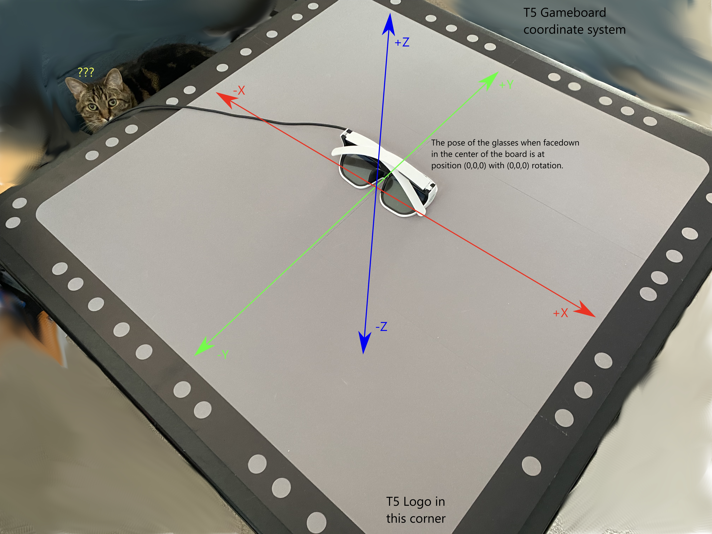

# Hello T5 Cube

Hello T5 Cube is a small OpenGL project to demonstrate using the [Tilt Five](https://www.tiltfive.com/) system's native SDK. 

### Command line options
<no commands> - Render separeate left and right images in to passes and submit them to T5

multiview - Render using multiview and submit stereo images to T5 via texture array

multiview-copy Render using multiview copy copying texture array layers to left and right textures and submitting the separare images to T5

debug - turn on GL_DEBUG_OUTPUT

## Build

Currently only Windows is supported. There is a Visual Studio solution for VS 2022 in the root directory. There is also a VS2019 solution in the vs2019 directory. The VS 2019 solution would need to be copied to the root to work. 

## Dependencies

- **OpenGL 4.6** 
- [**glad2**](https://github.com/Dav1dde/glad/tree/glad2) OpenGL loading   
- [**GLFW**](https://www.glfw.org/) Window management and OpenGL context creation
- [**GLM**](https://github.com/g-truc/glm) Math library
- [**TiltFive**](https://www.tiltfive.com/developers) Native SDK for the TiltFive Glasses

## TODO

- Change build to CMake to allow porting to linux
- Add wand tracking
- Support multiple glasses
- Documentation

## Notes

For reference it might be helpful to see how the t5 coordinate system is set up.

